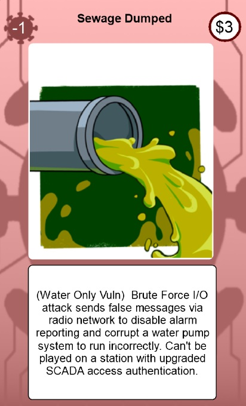

# 
accessDenied : Physical Card Game

The physical version of the card game is made using the same csv files for cards as the digital version and uses the free CardMaker program by Tim Stair (https://github.com/nhmkdev/cardmaker).

Note that the csv file assumes all images are located in a directory called images directly under the CardMaker exe program. The csv files are assumed to be found under the CardMaker exe directory in a folder called csvFiles. If these directories are changed, then the main CardMaker setup file needs to change as well.
