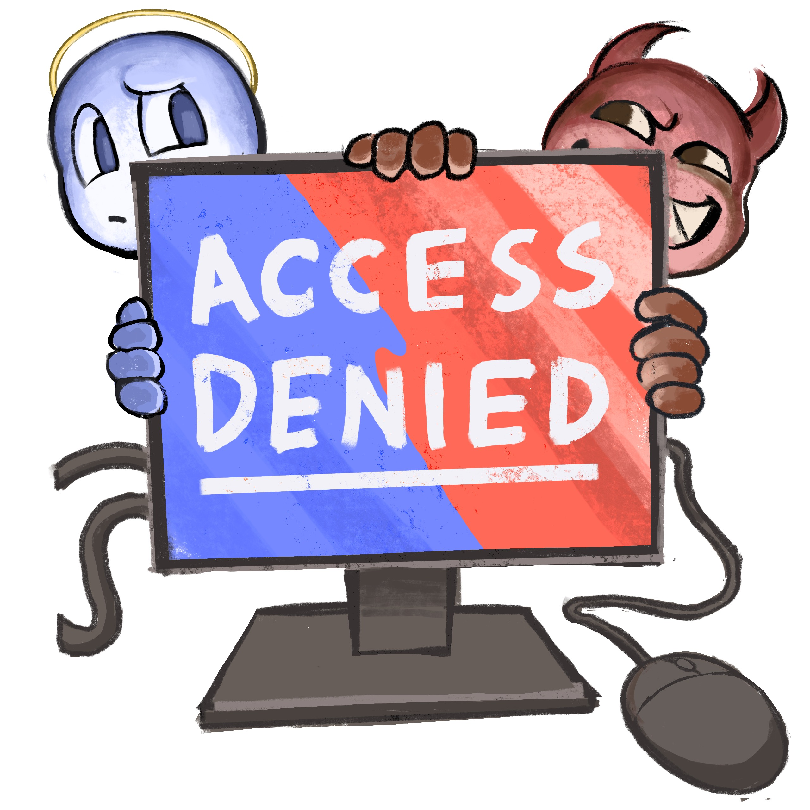
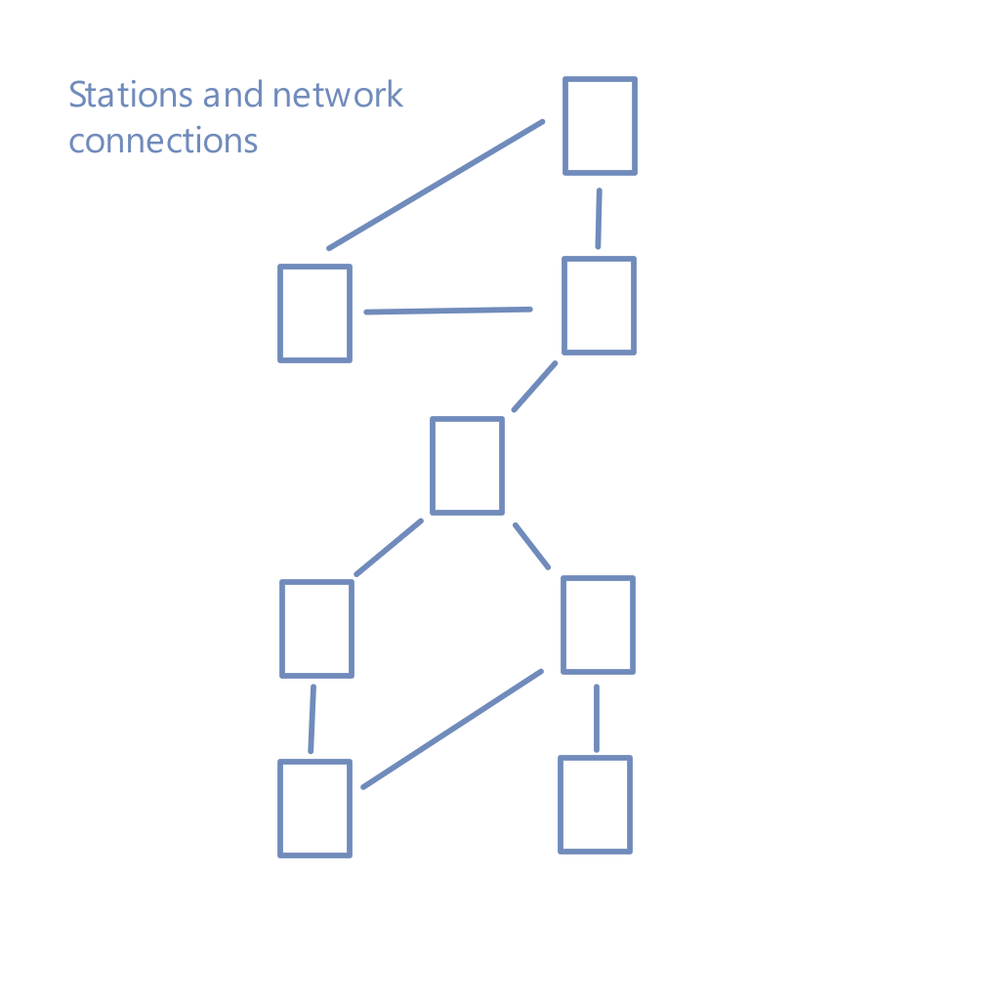
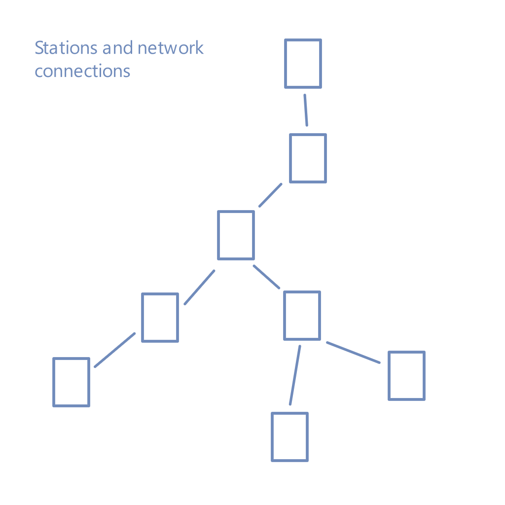

# accessDenied : Cybersecurity and Infrastructure Card Game
  

**Objective**: A fork of the resilience card game project for non-cyber security people. It's meant to help folks learn some basics about cyber security through learning attack and mitigation terms to help people be more productive when they participate in a scenario or war game with cyber security components after.

**Player Narrative**:

You want to help those in the facilities next door. For some of them, they may be your frenemies. Whenever your people notice a potential vulnerability in your neighbor’s facilities, you tell them about it. Sometimes you talk about the vulnerability because it’s interesting. Sometimes you point at them in amusement because they’ve gained a really common vulnerability that people should have foreseen coming.
Other players do the same and point out vulnerabilities with your facilities. 

Sometimes information about the vulnerabilities doesn’t get fixed in time (there are never enough resources to fix everything all at once!) and you’re attacked. The end goal is to mitigate as many found vulnerabilities for your facilities as possible with limited resources/people (represented by cards) while pointing out all the vulnerabilities you can find in other players’ facilities.

In real life winning means nobody gets attacked successfully, but in the game whoever has the most points left in facilities plus added defense cards wins.

**Educational Goals**

- Education, but not training
- Linking attacks to defense/mitigation
- Considering control system breaches (even below SCADA)
- Using information from real world events in cards:
  - 2000 Maroochy Water Services, Australia (water treatment)
  - 2016 Kyiv power grid cyber attack (power)

## Game Description
  - Number of players: 2 (later more as more decks are added)
  - **Deck shuffling**:
    - Shuffle all facilities per player into their own deck minus one 2pt starting facility. Place the rest of the deck face down.
    - Shuffle the rest of your deck and place cards face down in a separate pile from the facilities deck.
  
  - **Starting cards for each player**:
    - Each player has a discard pile for cards from their own deck. The discard pile starts out empty.
    - Place one 2pt facility face up in front of yourself.
    - Decide on how each player’s facilities will be connected when they are drawn over time from the facilities deck. Examples for the 8 facilities of a facility deck appear below. Both players should know each other’s connection diagrams, so draw it somewhere so both players can see.

    

  - Attackers are simulated by a d20 die roll. To get an online die look up the words: d20 roll.

## Game Phases

All players do each phase together and nobody starts the next phase before everybody has finished the current phase.

**Draw regular card phase**: Draw until you have 6 cards in your hand. Optionally, you may discard one to two cards into your discard pile and redraw until you get 6. The round always starts with six cards per player unless it’s the end of the game where somebody has run out of cards.

**Defense phase**: Lay down up to 1 card that gives defense to a facility (+1 are most common). This phase may be skipped if nobody has any cards to play. Defense and station cards have a blue title background.

**Vulnerability phase**:

Spend the number of points in facilities you own (not impacted by current “health” of facility, which is only used to subtract facilities from the game and calculate the end score) to let other players know the vulnerabilities you’ve discovered on their stations.

- Any players without vulnerabilities to play must wait for all other players to play their vulnerabilities before going into the Mitigation phase.
- More than one vulnerability can be played on a station (only 1 of any type though)
- Vulnerabilities are played face up to allow them to later be countered. Usually the card is placed crosswise on top of a facility.
- Vulnerability cards have a red title background.
- Instant negative cards should be played in this phase to allow for instant counters. Note: instant cards ARE NOT spread by the Lateral Movement card.
- DO NOT immediately mitigate vulnerabilities as they’re played. Waiting for the mitigation phase to counter ALL vulnerabilities except for instant cards means that you will be able to choose which cards to counter in the case where there are more vulnerabilities than mitigation cards to counter them.

**Mitigation phase**: Remove vulnerabilities from your stations by countering them with mitigation cards from your hand. Mitigation cards have a yellow title background. Countered vulnerabilities go into the discard player of whomever played the cards. Mitigation cards go into your discard pile.

**Attack phase**:

- For the vulnerability cards that cannot be countered, roll a d20 to see if the vulnerability is attacked. Anything >10 is assumed to be a successful attack.
- For successful attacks, take off the points lost for that facility AND discard the vulnerability into the player’s discard pile for whomever played the card. Note: once a facility is <= 0 points it’s removed from play and those points are lost permanently. To indicate points taken off where the facility points remain >0 use a token (coins work) to indicate a facility has lost points.
- All vulnerabilities (including lateral movement) are left until either mitigated or the vulnerability is exploited. Lateral movement goes away when it is either mitigated OR used to do a lateral movement of any successful  exploit once. Lateral movement cards should be resolved in the order they were played.

**Facility phase**: Draw a new station from the facility card pile every turn until the facility card pile is empty. Place cards in the agreed upon network configuration. If you lose a facility, it is all right to place a new facility where the old one was located. Players are allowed to place facilities in whatever order they prefer.

**Repeat from step 1** until one player runs out of cards OR one player loses all their facilities. Score is tallied from the points facilities remaining in play minus their subtracted points plus their defensive bonuses.

## Learning the Game and Suggested Alternate Rules

**Learning**: Play the game as specified above without any special rules to learn the game. It helps to talk out loud while playing to incorporate the meanings of the cards and discuss cybersecurity with the other player(s).

**Speed game**:

- Place all facilities at the very beginning of the game and allow for their full point usage in pointing out vulnerabilities and mitigating them.
OR
- Allow for a full 6 card discard/draw at the beginning of each turn rather than the default 2 card discard/draw allowance.

**More advanced strategic play**:

- Each facility has icons for its most and least vulnerable categories because let’s face it, some facilities are more/less vulnerable than others. Use those icons to build out a less vulnerable network of facilities. More vulnerable icons are 70% likely to have a successful attack if not mitigated (1-6 is an unsuccessful attack on a d20). Less vulnerable icons are 30% likely to be successfully attack (1-14 on a d20 is an unsuccessful attack).
- A player can’t use a facility’s points in pointing out vulnerabilities if the facility is attached to nothing in the rest of the network. That facility will still count in points at the end of the game though and can still be attacked.
- Explain the best and worst ways to attack each network at the end of the game in a discussion between players.

**More advanced educational play**:

- Explain WHY or HOW you would protect or lose a facility beyond what the cards say. If there is a reason a card that ordinarily doesn’t counter a facility might in a specific situation, argue your case. Note: it helps to have a neutral referee if you’re going to do that.
- Explain different reasons a facility would be put offline outside of what the cards say.
- Got a new attack/defense in mind? Replace some of the cards with your new attack/defense (the game comes with the ability to do a pdf with cards OR make new digital cards) and make sure to explain it when players come across it. Both players can have fun coming up with the attacks they think would work the best along with mitigations to counter those attacks.

